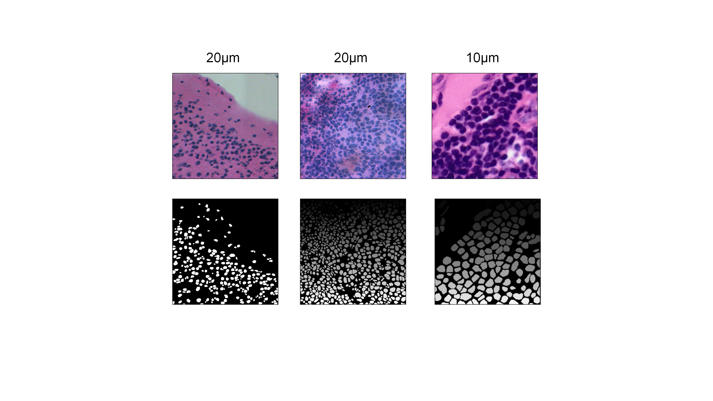

# Cancer Cell instance Segmentation Network 用于苏木精-伊红染色的癌细胞实例分割网络


## Introduction
本文提出基于 Segment Anything Model(SAM) 的细胞分割模型 CCSN，通过训练一个细胞识别器 CellDetecter 生成提示框驱动 SAM 实现高精度分割。实验表明，CCSN在H&E载玻片数据上性能与 SOTA 模型 CellViT 相当，而在芯片数据集 CellBinDB 上显著优于现有模型 cellbin2（F1分数提升8%），尤其在复杂细胞群分割中边界识别更准确。


## Installation

```
git clone https://github.com/zhangzhenke/CCSN.git  
cd ccsn 
```
- Create an environment for CCSN.
```
# python3.8 in conda env
conda create --name=ccsn python=3.8
conda activate ccsn
pip install -r requirements.txt
pip install git+https://github.com/facebookresearch/segment-anything.git
```
- Download the necessary model file

    [sam_vit_b_01ec64.pth](https://dl.fbaipublicfiles.com/segment_anything/sam_vit_b_01ec64.pth)  
    [MAE](https://dl.fbaipublicfiles.com/mae/pretrain/mae_pretrain_vit_large.pth)  
    After downloading the model file, place it in the **src/models** directory of the project.


## CellFinder
细胞检测器，产生目标框供SAM模型提示产生精确的分割掩码。
```
📦CellFinder
 ┣ 📂PublicData
 ┃ ┣ 📜CellFinder.py
 ┃ ┣ 📜datasets.py
 ┃ ┣ 📜engine.py
 ┃ ┣ 📜label_flow_mask.py
 ┃ ┣ 📜main_train.py
 ┃ ┣ 📜transforms.py
 ┃ ┃ ┗ 📜ytils.py
 ┣ 📂PreTrain
 ┃ ┣ 📜engine_pretrain.py
 ┃ ┣ 📜main_pretrain.py
 ┃ ┗ 📜models_mae.py
 ┗ 📂CellBinDB
```


## Tutorials
### Data
[CellBinDb Data download link](https://bgipan.genomics.cn/#/link/v2dKKUZf8M3YFpGWvB5g)    

[Lizard Data download link](https://link.zhihu.com/?target=https%3A//www.kaggle.com/datasets/aadimator/lizard-dataset)

[Conic Data download link](https://conic-challenge.grand-challenge.org/Data/)

[Monuseg Data download link](https://monuseg.grand-challenge.org/Data/)

[PanNuke Data download link](https://warwick.ac.uk/fac/sci/dcs/research/tia/data/pannuke)

[PanNuke Data download link](https://warwick.ac.uk/fac/sci/dcs/research/tia/data/pannuke)


### Use via command line
#### Cell segmentation
- Modify the parameters in the following command and input it into the command line:  
```
python Demo/main_ccsn.py -i your_inputpath -o your_outputpath -n  ypur_filename -b  
```
- Where:

- -i is the input image path  
-o is the output mask path  
-n is the your file name  
-b is the 0.25mpp   


#### Segmentation evaluation
- Ensure that the images in the gt folder have filenames with "**_mask**" and the images in the algorithm output mask folder have filenames with "**_img**", with only this difference in their names.   
  
- Modify the parameters in the following command and input it into the command line:
```
python src/eval/predict_ccsn.py -g gt_path -d dt_path -o result_path
```
- Where:

- -g is the path to the ground truth (GT) folder  
-d is the path to the algorithm output mask folder  
-o is the output path for the results 


## License and Citation


## Reference 
> [sam](https://github.com/facebookresearch/segment-anything)   
> [mediar](https://github.com/Lee-Gihun/MEDIAR)   
> [stardist](https://github.com/stardist/stardist)    
> [mae](https://github.com/facebookresearch/mae)   